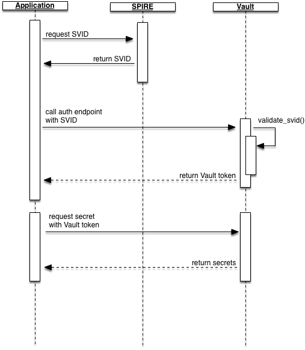

# Implementation Design
This document contains the high-level implementation design.

## SPIFFE Identity
[SPIFFE Identity Documentation](https://github.com/spiffe/spiffe/blob/master/standards/SPIFFE-ID.md#2-spiffe-identity)

The SPIFFE ID contained within the SPIFFE Document (SVID) is represented by the URI syntax `spiffe://[trust_domain]/[path]`. The Trust Domain is a required element and represents the top level of trust for a logical separation.  Path is the element which represents the unique name for the application or service and follows a canonical URI path.  The structure of the path is determined by the operator of the system and paths may be used to identify sub divisions within a service.  Operators can choose to build SPIFFE IDs in a number of ways, for example the payments queue in the following examples could be constructed by creating a dedicated Trust Domain (which may or may not be signed by the prod trust domain) or it may be constructed as a path on the prod trust domain.

| SPIFFE ID                                   | Trust Domain  | Application ID       | Comments                                           |
| ------------------------------------------- | ------------- | -------------------- | -------------------------------------------------- |
| spiffe://prod.acme.net/123-123d-sdfs3       | prod.acme.net | 123-123d-sdfs3       | Generic service identifier using GUID              |
| spiffe://prod.acme.net/currency/mysql       | prod.acme.net | currency/mysql       | MySQL database for the currency service            |
| spiffe://prod.acme.net/currency/web         | prod.acme.net | currency/frontend    | Application Frontend for the currency service      |
| spiffe://payments.prod.acme.net/email/queue | payments.prod.acme.net | email/queue | Queue for the email service in the payments domain | 
| spiffe://prod.acme.net/currency/web         | prod.acme.net | payments/email/queue | Queue for the email service in the payments domain | 

### Trust Domains
The below tables show some example SPIFFE trust domains and how they may map to a Vault cluster and auth point, the current examples would validate based on and individual trust domains CA, there is currently no concept for hierarchical trust domains and validation based on trust chain.  
**Trust Domains will map to Vault SPIFFE Auth mount points as a 1-1 relationship**

#### Simple example where an organization has a single trust domain per environment
It is generally good practice to isolate secrets across environments, for example a developer may have different levels of permissions on a Dev cluster which does not carry production data.  Staging would most likely not be using production datastores or other elements however depending on the purpose of the Staging environment, i.e. should it carry sensitive or regulated information then it would most likely have tighter access control.  If Staging uses dummy or non-sensitive data then it could potentially share the development Vault cluster.

| Trust Domain            | Vault Cluster | Auth Mount Point |
| ----------------------- | ------------- | ---------------- |
| spiffe://prod.acme.net/ | Production    | /v1/auth/spiffe  |
| spiffe://stg.acme.net/  | Staging       | /v1/auth/spiffe  |
| spiffe://dev.acme.net/  | Development   | /v1/auth/spiffe  |
  
  
#### Example showing `spiffe://prod.acme.net/` as a global identity and a trust domain per geo location.
A large geo-distributed application would most likely run Vault premium which allows multi-datacenter performance replication.  In this instance a Vault Cluster would exist in each Region however the Clusters would be joined and in terms or read and writes would share the same data.

| Trust Domain               | Vault Cluster | Auth Mount Point   | Comments |
| -------------------------- | ------------- | ------------------ | ------------------------------------------ |
| spiffe://us.prod.acme.net/ | Production    | /v1/auth/spiffe/us | Vault premium with performance replication | 
| spiffe://eu.prod.acme.net/ | Production    | /v1/auth/spiffe/eu | "" |
| spiffe://ap.prod.acme.net/ | Production    | /v1/auth/spiffe/ap | "" |


#### Trust domain per department or application boundary
In the below example, the two trust domains `insurance` and `consumer` would most probably share the same cluster in an enterprise.  However, Support may or may not use it's own cluster, ideally support would require access to secrets such a Database Users, AWS credentials, etc, therefore it would make sense to allow access to the main Vault cluster instead of having to replicate and maintain secrets in two clusters.  Policy in Vault would allow for privilege to be restricted to the right levels ensuring any sensitive information which support are not allowed to access remains secret.  The organization would most likely leverage Vault premium's capability to run in more than one datacenter. If the organization was particularly security adverse then they may use their own infra for support application secrets and allow support personnel to auth the production Vault cluster to obtain the secrets required to solve problems.

| Trust Domain                                     | Vault Cluster  | Auth Mount Point         | Comments  |
| ------------------------------------------------ | -------------- | ------------------------ | --------- |
| spiffe://insurance.bigbank.com/                  | Production     | v1/auth/spiffe/insurance |           |
| spiffe://consumer.bigbank.com/                   | Production     | v1/auth/spiffe/consumer  |           |
| spiffe://support-site.prod.consumer.bigbank.com/ | Production?    | v1/auth/spiffe/support   | support-site has dedicated infra |

## Vault Identity Mapping 
[Vault Identity Secrets Engine Documentation](https://www.vaultproject.io/docs/secrets/identity/index.html)
Given the possible structure combinations as seen in the examples of SPIFFE IDs and Trust Domains Vault Identity Mappings will translate to the following simplified levels:

| SPIFFE       | Vault  |
| ------------ | ------ |
| Trust Domain | [Group](https://www.vaultproject.io/api/secret/identity/entity.html)  |
| Path         | [Entity](https://www.vaultproject.io/api/secret/identity/group.html)  |

This will allow the operator to assign policy to a Trust Domain level and additionally have finer grain control on an application or service level, following standard Vault policy assignment Entity level policy could either be added or subtracted from the Group level.

| SPIFFE ID                                | Vault Group      | Vault Entity       |
| ---------------------------------------- | ---------------- | ------------------ |
| spiffe://prod.acme.net/currency/web      | prod.acme.net    | currency/web  |
| spiffe://staging.acme.net/currency/web   | staging.acme.net | currency/web  |
| spiffe://prod.acme.net/123-123d-sdfs3    | prod.acme.net    | 123-123d-sdfs3     |

## Vault Auth Endpoint Mapping
As previously mentioned in this document Auth Mount points will be mapped to Trust Domains as a **1-1** relationship

## Authentication Flow
A simplified happy path authentication flow would look something like:



1. Application requests a SPIFFE ID from the local SPIRE server which returns an SVID, private key, CA, etc
2. Application calls the Vault auth endpoint for the plugin passing the SVID as a parameter
3. Vault validates the SVID against the pre-configured CA and returns a Vault token for the mapped identity
4. Application uses Vault token to request secrets
5. If token is valid and token has permission to secret, returns secret

## Vault Endpoints
The below outline shows how a user would use the plugin:

### Config
The auth endpoint must be configured with a trust domain this is configured with the ca bundle for the trust domain in order to validate login requests

```bash
$ vault write auth/spiffe/config trust_domain=prod.acme.net ca_bundle=@bundle.pem
```

#### Assigning policy to a trust domain
Policy can be assigned at a trust domain level, all authenticated users/services who are part of this domain will be assigned the policy at this level.

```bash
$ vault write auth/spiffe/map/domain value=dev-policy
```

#### Assigning policy to an individual SPIFFE id
In addition to a trust domain level policy can be assigned to an individual SPIFEE Id, because a spiffe ID can be both URI path style and free text, it may be useful to specify the spiffe Id as part of a the request parameters rather than request path.

```bash
$ vault write auth/spiffe/map/id spiffe_id=123-121321 value=web-policy
$ vault write auth/spiffe/map/id spiffe_id=currency/web value=web-policy
```

instead of:

```bash
$ vault write auth/spiffe/map/123-123121 value=web-policy
$ vault write auth/spiffe/map/currency/web value=web-policy
```

## Assumptions
* SPIFFE allows a Trust Domain to be signed by a parent Domain forming a chain of trust, it is assumed that Vault would validate an SVID based on the full CA bundle and would **NOT** validate a leaf node based on the Root CA.
* Vault will consider a SPIFFE ID Path as a unique entity per Trust Domain (SPIFFE Auth Mount) and will not consider sub paths.

## References:
* [Vault Identity (Entity)](https://www.vaultproject.io/api/secret/identity/entity.html)
* [Vault Identity (Group)](https://www.vaultproject.io/api/secret/identity/group.html)
* [SPIFFE Identity](http://github.com/spiffe/spiffe/blob/master/standards/SPIFFE-ID.md#2-spiffe-identity)
* [SPIFFE Verifiable Identity Document](https://github.com/spiffe/spiffe/blob/master/standards/SPIFFE-ID.md#3-spiffe-verifiable-identity-document)
